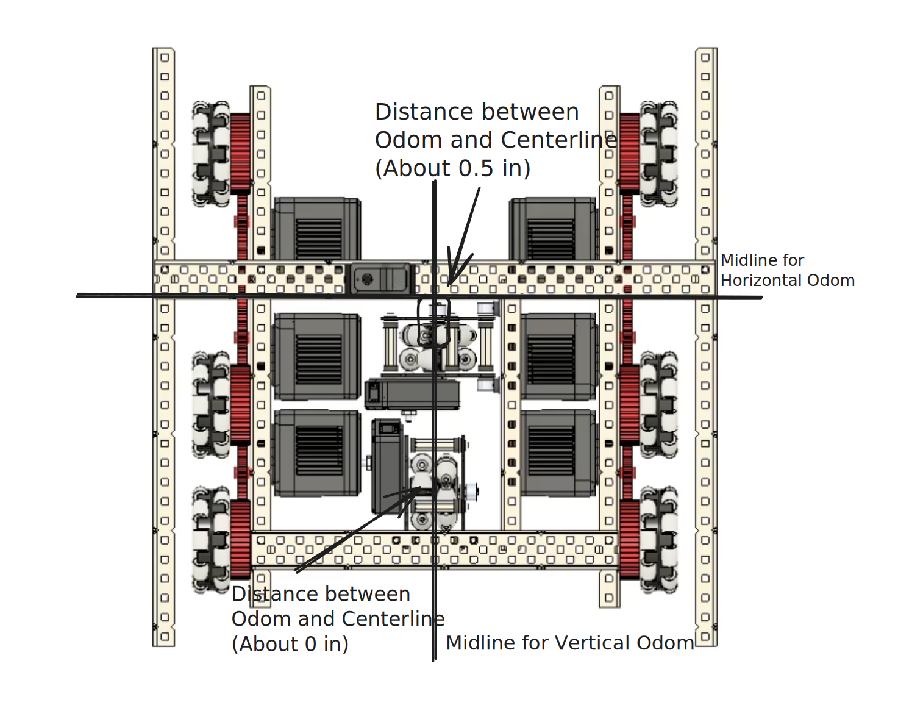

# Configuring Odometry in C++

Let's quickly setup your Odometry Wheel(s).


If the configuration is not followed correctly, problems with the robot/code can arise. **Be careful.**




### Main File Structure

Open the "src" folder on the right, if you have not done so already.

<figure><figcaption></figcaption></figure>



### Configuring Odometry Wheels and Directions - main.cpp

You should see:


```cpp
// ez::tracking_wheel horiz_tracker(8, 2.75, 4.0);  // This tracking wheel is perpendicular to the drive wheels
// ez::tracking_wheel vert_tracker(9, 2.75, 4.0);   // This tracking wheel is parallel to the drive wheels
```


If you are using only the **Vertical**/1 Odometry Wheel, delete the // comment for that line, eg:


```cpp
// ez::tracking_wheel horiz_tracker(8, 2.75, 4.0);  // This tracking wheel is perpendicular to the drive wheels
ez::tracking_wheel vert_tracker(9, 2.75, 4.0);   // This tracking wheel is parallel to the drive wheels
```


If you are using the **Vertical and Horizontal**/2 Odometry Wheels, delete the // comment for those lines, eg:


```cpp
ez::tracking_wheel horiz_tracker(8, 2.75, 4.0);  // This tracking wheel is perpendicular to the drive wheels
ez::tracking_wheel vert_tracker(9, 2.75, 4.0);   // This tracking wheel is parallel to the drive wheels
```


Now you can configure the trackers.&#x20;


8/9 = Ports Connected into the Brain.

2.75 = Wheel Diameter **(You should only be using 2 inch tracking wheels, so change it to 2).**

8/9 = Ports Connected into the Brain.

2.75 = Wheel Diameter **(You should only be using 2 inch tracking wheels, so change it to 2).**

4.0 = Distance in Inches to Center of Robot.


To help you for the Distance in Inches to Center of the Robot (Use a ruler):





### Configuring Odometry Position - main.cpp

Next if you scroll down slightly, you should see:


```ada
  // Look at your horizontal tracking wheel and decide if it's in front of the midline of your robot or behind it

  //  - change `back` to `front` if the tracking wheel is in front of the midline
  // chassis.odom_tracker_back_set(&horiz_tracker);
  
  // Look at your vertical tracking wheel and decide if it's to the left or right of the center of the robot
  
  
  //  - change `left` to `right` if the tracking wheel is to the right of the centerline
  // chassis.odom_tracker_left_set(&vert_tracker);
```



This code allows the trackers to determine where they are in the robot, allowing your autonomous movements to be centered, no matter where the trackers are in the robot.


Using the above picture with the robot's back facing you, determine the midline offsets for the trackers.

In the picture, the Horizontal tracker should be (Back Set):

```abap
chassis.odom_tracker_back_set(&horiz_tracker);
```

The Vertical tracker should be (Left/Right Set):

```
chassis.odom_tracker_left_set(&vert_tracker);
```

**In the picture,** because it looks like the Vertical tracker is directly in the center of the midline **in this case, it doesn't matter if it is "left" or "right".**



You have now setup your odometry to use for the autonomous period movements.

**Press "Next" to go to instructions on how to create and use driver control functions.**
