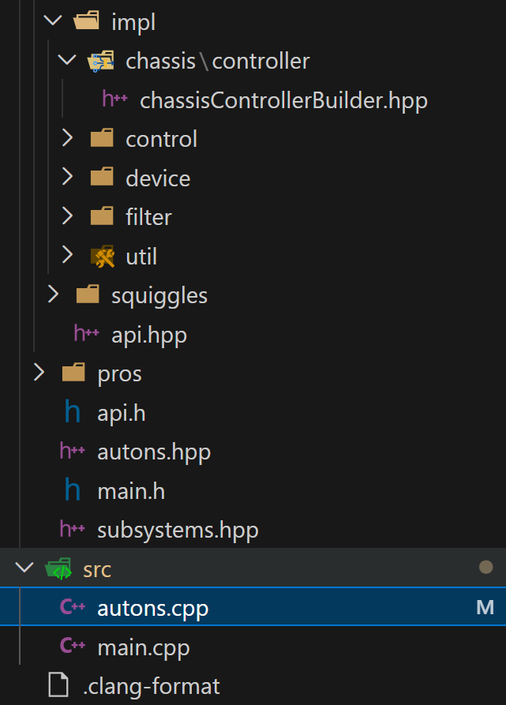

# Pistons (Pneumatics)

Pistons are controlled by a **pneumatic solenoid** plugged into a **3‑wire (ADI) port**.

In PROS, a piston is just a **digital output** with two states:

* `true` → extends (or “fires”)
* `false` → retracts

On this page you will make one piston that:

* Toggles with a controller button during **driver control**
* Can also be used later in **autonomous**

The goal is: **“Press a button → piston toggles.”**

***



### Step 1 – Find the ADI port your solenoid is plugged into

On the V5 Brain, the 3‑wire ports are labeled **A–H**.

1. Plug your solenoid’s 3‑wire cable into a port (example: **A**).
2. Keep note of the letter. You’ll use it in code like `'A'`.


If the solenoid is not plugged into a 3‑wire (ADI) port, this code will not work.


<figure><figcaption></figcaption></figure>

<figure><figcaption></figcaption></figure>



### Step 2 – Create the piston in `subsystems.hpp`

Open `include/subsystems.hpp`.

<figure><figcaption></figcaption></figure>

Add a inline ez::Piston PISTON\_NAME('PORT'); for your piston:


```cpp
// Put your motors, sensors, etc. here

inline ez::Piston doinker('A');   // Change 'A' to your ADI port letter
```



Name it after the mechanism, change “clamp” to something else.

Examples: `clamp`, `wings`, `doinker`, `hang`, `blocker`.


#### If you have multiple pistons

Just create more `DigitalOuts`:


```cpp
inline pros::adi::DigitalOut clamp('A');
inline pros::adi::DigitalOut wings('B');
```




### Step 3 – Toggle the piston with a button (Driver Control)

To control a piston we can:

```cpp
clamp.set_value(true);   // extend
clamp.set_value(false);  // retract
// "clamp" is the name of the piston you set in subsystems
```

For pistons, **toggle** control is usually best:

* Press once → extend
* Press again → retract

Put this inside the `while (true)` loop in `opcontrol()` in `src/main.cpp`:


```cpp
void opcontrol() {
  chassis.drive_brake_set(MOTOR_BRAKE_COAST);

  while (true) {
    ez_template_extras();
    chassis.opcontrol_tank();
    
    clamp.button_toggle(master.get_digital(DIGITAL_R1));
     

    pros::delay(ez::util::DELAY_TIME);
  }
}
```



`doinker.--- is the piston, it will toggle on and off using the R1 Button`


Here's just the toggle code (above) you can put in the driver function:

```cpp
clamp.button_toggle(master.get_digital(DIGITAL_R1));
```



### Step 4 – (Optional) Hold-to-extend instead of toggle

Some mechanisms feel better as “hold-to-fire”:

* Hold button → extend
* Release → retract

**Put this in the driver function like the toggle example above:**


```cpp
doinker.set(master.get_digital(DIGITAL_R1));
// That's it...
```




### Step 5 – (For Later) Use the piston in Autonomous

Because the piston is created in `subsystems.hpp`, you can use it in autonomous the same way:

```cpp
doinker.set(true);
// That's it...
```

In this example, the `true` signifies the extension/retraction of the piston and the `false` would signify the opposite of the true state - **There's more on this in the Build: Piston Tutorial.**



***

### Troubleshooting:

If the piston is not moving when the controller is pressed:

1. The solenoid is plugged into the **correct ADI port** (A–H).
2. The port letter in `DigitalOut('A')` matches the **actual** port.
3. Your button code is **inside the `while (true)` loop** in `opcontrol()`.
4. `pros::delay(ez::util::DELAY_TIME);` is still at the bottom of the loop.
5. The Solenoid, or Solenoid Cable is not broken.
6. The Solenoid Cable Gold Pins are **not bent or broken.**

Once this works, repeat the same pattern for any other pistons.


**Good Work!!** Now your robot should be fully drivable and able to use motors and pistons. We can now focus on the Autonomous aspect of VEX Matches and Skills.

As usual, press next for the Autonomous Route intro.
